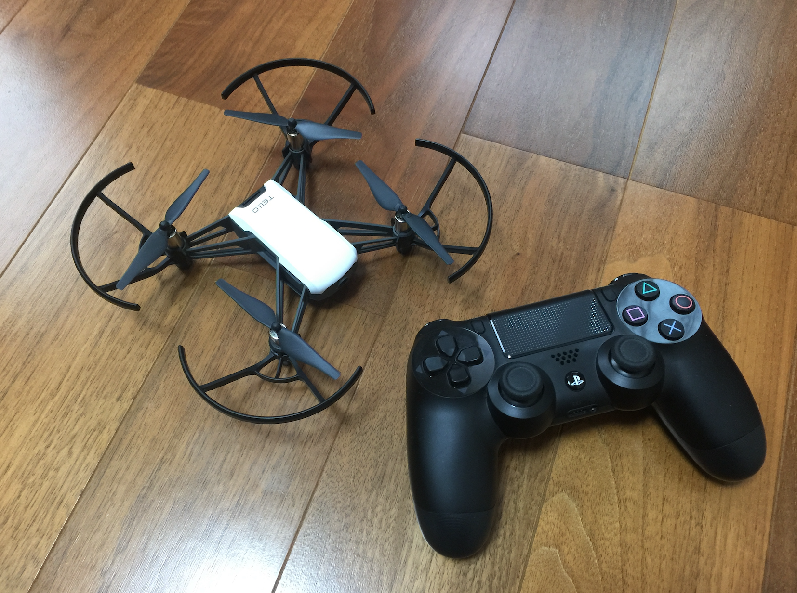
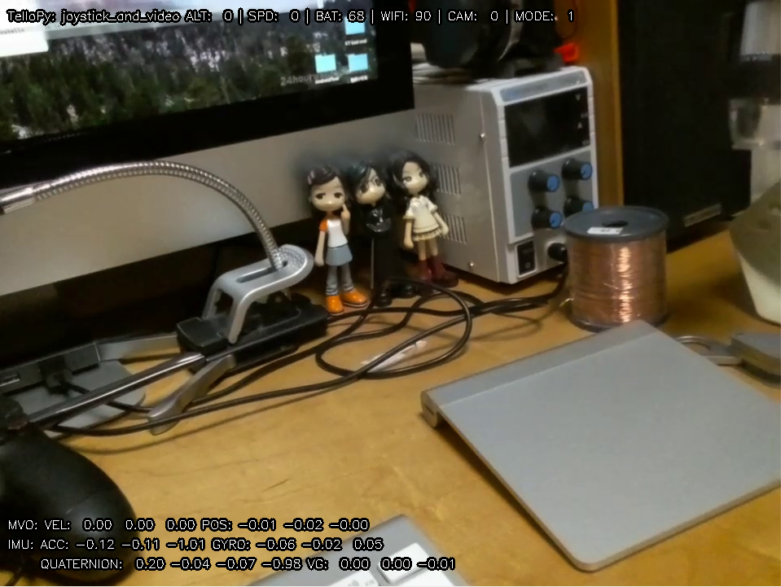

# DJI Tello drone controller python package

This is a python package which controlls DJI toy drone 'Tello'. The major portion of the source
code was ported from the driver of GOBOT project. For original golang version and protocol in
detail, please refer their blog post at
https://gobot.io/blog/2018/04/20/hello-tello-hacking-drones-with-go

##What currently works
- Controls
- Video
- Real-time telemetry 
- Logging

##TODO for Accelerate
- DSE Service
- Authentication/User tracking
- Leaderboards 



## How to install
You can install stable version from PyPI.

You can use PS3/PS4/XONE/KB joystick to controll Tello.

```
$ pip install tellopy
$ pip install av
$ pip install opencv-python
$ pip install image
$ pip install pygame

```

## Documents
Please see the API docstring.
```
$ python
>>> import tellopy
>>> help(tellopy)
Help on package tellopy:
...
```

## Examples

You can find basic usage of this package in example code in the examples folder.

### simple_takeoff
This example let Tello take off. Tello will land automatically after a few seconds.

```
$ python -m tellopy.examples.simple_takeoff
```



## Tellopy side projects

### Hand_motion Tello controller

You can find a hand_motion controller for the Tello in this project: https://github.com/GalBrandwine/HalloPy,
and controll your tello using hand movements!

###  OpenCV based Tello controller

This interfaces with the drone through openCV and generates frames from the video stream for computer vision applications. It comes with a tracker that will detect a color in the scene and follow it:
https://github.com/Ubotica/telloCV/
 
