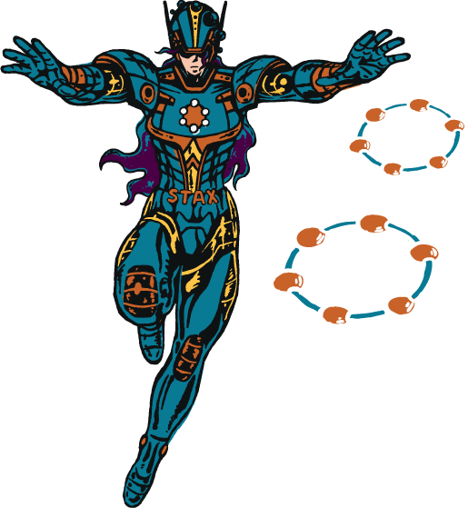
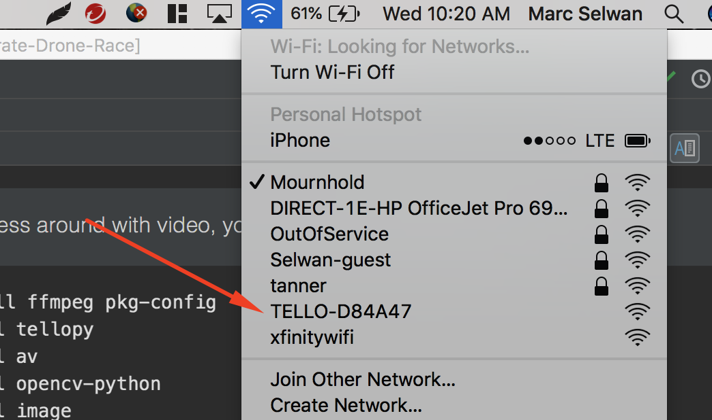
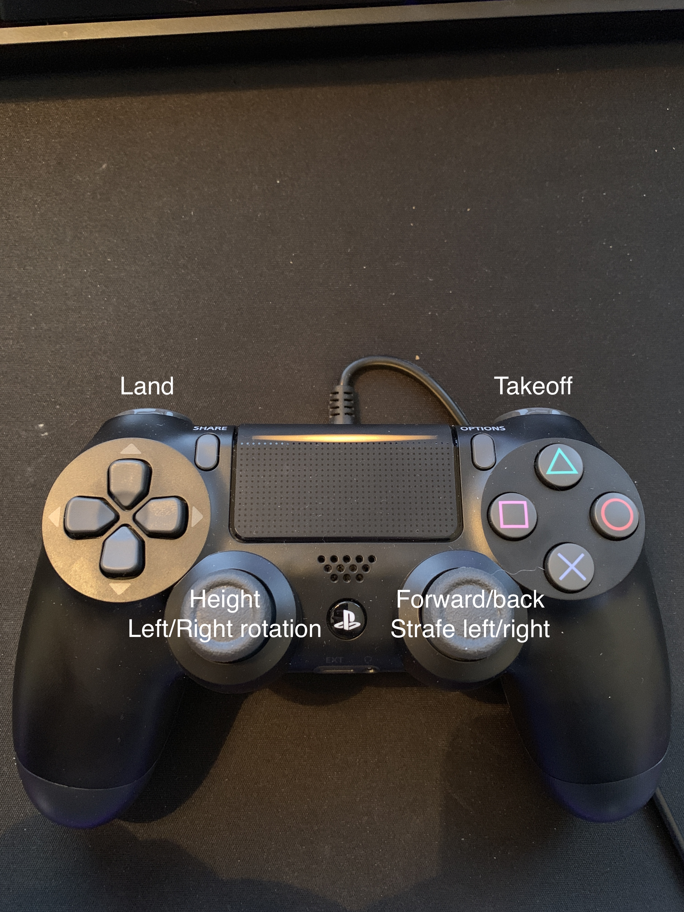

# Drone Race Project for DataStax Accelerate

This is a python package which controls the DJI 'Tello' drone. The major portion of the source
code was ported from the driver of GOBOT project. See the original golang version and protocol in
detail, please refer their blog post at
https://gobot.io/blog/2018/04/20/hello-tello-hacking-drones-with-go

Much of the core of this project comes from: https://github.com/hanyazou/TelloPy




## How to install

NOTE: Xbox controllers will not work on recent versions of MacOS, even with 3rd party drivers. 

For DataStax Accelerate, we are not using the video streaming functionality. It's in the code, commented out. Install just what's needed for Accelerate:

```
$ pip install -r requirements.txt
```

If you'd like to mess around with video, you'll need to install the following:


```
$ brew install ffmpeg pkg-config
$ pip install tellopy
$ pip install av
$ pip install opencv-python
$ pip install image
```

## How to start the app

First, you'll want to run: `$ ./start-drone-app.sh`

This will start the Python application that controls the drone and sends telemetry data to the UI

Then, you'll want to turn on your Tello Drone and connect to its WiFi



Once you're connected, you're ready to take off! 


## Controls

See image below for controls 


 

 
